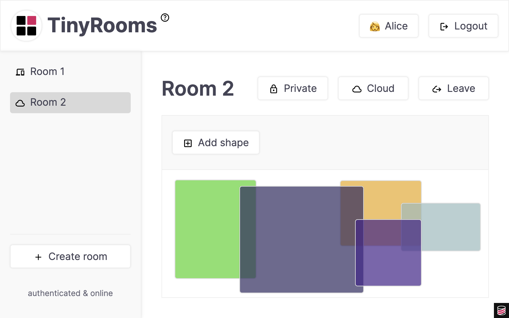
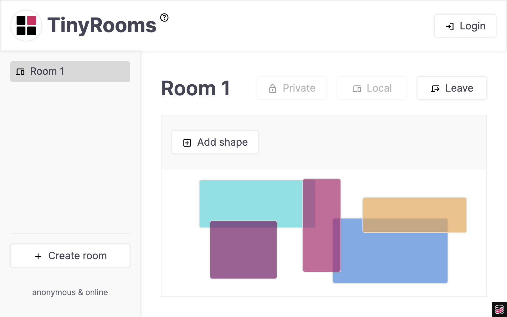
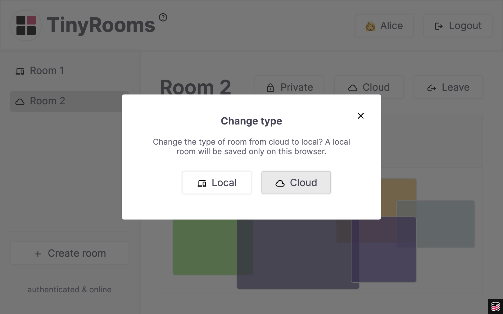
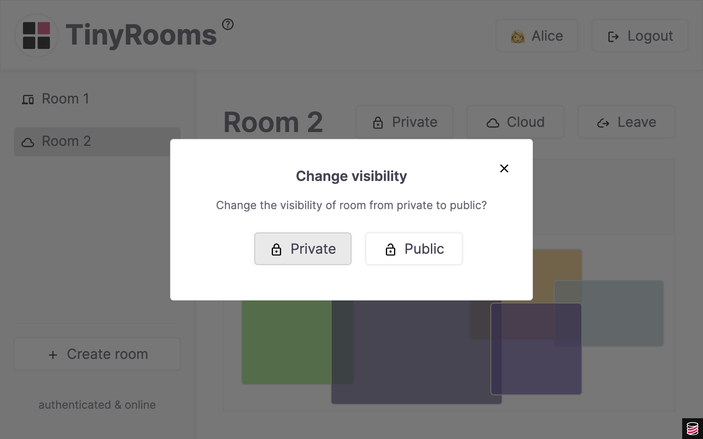
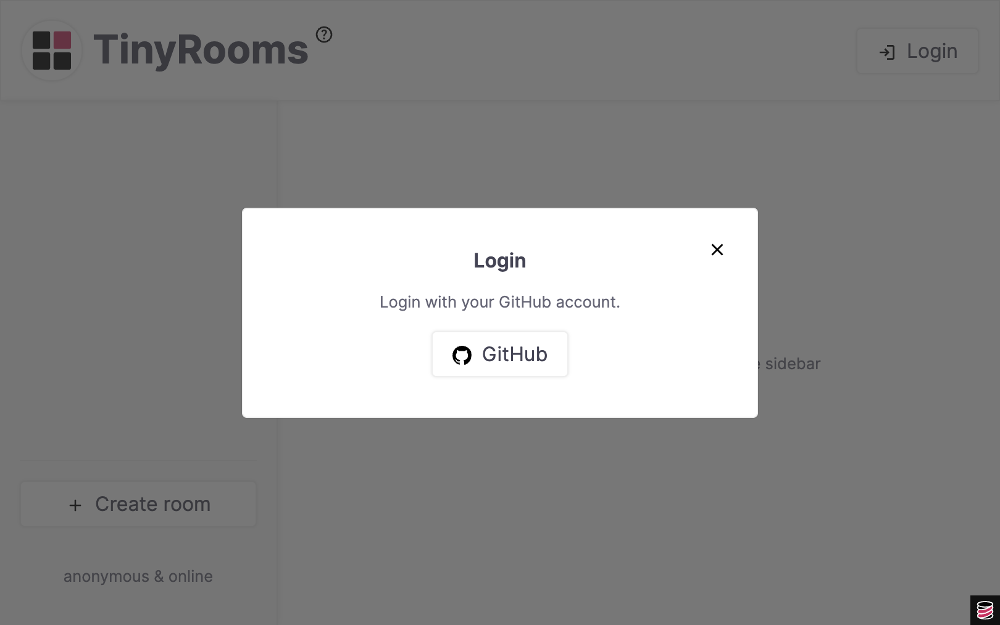
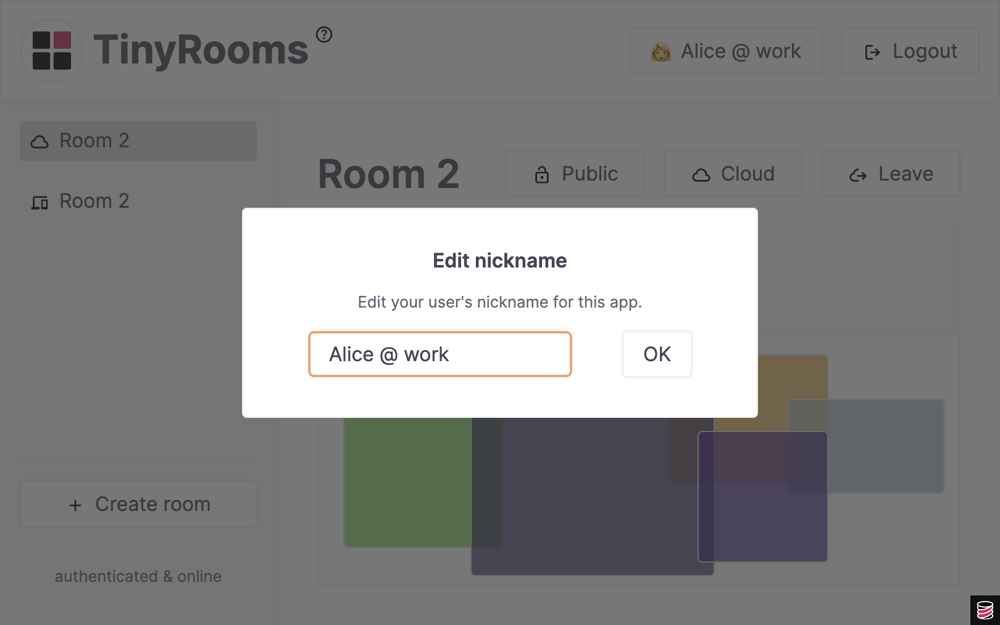
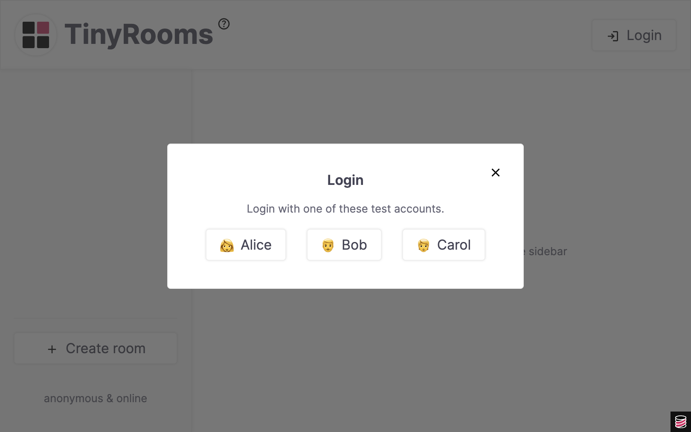

# TinyRooms

TinyRooms is a local-first app demo, using [TinyBase](https://tinybase.org/),
[PartyKit](https://www.partykit.io/), and optional GitHub OAuth. It is designed
to explore the challenges of (and possible solutions for) building local-first
apps in the real world.



It's expected that you will [install this app
locally](https://github.com/tinyplex/tinyrooms#installing-tinyrooms) to try it
out, but if you are brave, you can try a deployed version
[here](https://tinyrooms.jamesgpearce.partykit.dev/).

## The complexity of the local-first state machine

[Local-first](https://localfirstweb.dev/) applications allow users to interact
with data on their own devices, even when offline, and store it locally. But
local-first does not mean local-only! The user should also be able to share
their data with others, and store it on a server too.

There are various states that such an app ideally needs to support:

- The user can be online or offline
- The user can be authenticated or anonymous
- The data can be stored locally or remotely (or both)
- The data can be private or shared

That's already four dimensions with sixteen states to handle! Thankfully we can
choose to make some of them invalid: if you are anonymous and offline, you can't
access shared remote content, for instance.

But there are still many states to deal with, and also some tricky transitions
between them. What happens if a user is viewing data shared by another user, has
a local copy of it, but then logs out, for example? Is that local copy preserved
or deleted?

This state machine is unfortunately a lot more complex than a traditional
cloud-first app (where the user is always online and authenticated, and the data
is always stored remotely). While the TinyRooms demo does not have all the
answers, it tries to address some of these challenges.

## The TinyRooms experience

TinyRooms is oriented around the concept of a 'room', which you can think of as
whatever can be stored in a single database. For the purposes of this demo, a
room is a canvas where you can create colored rectangles and move them around.
But any sort of content experience could be mounted into the overall app. Shared
todo lists, collaborative whiteboards, notebooks, and so on.

The app lets users create a room whether they are authenticated or not. This
facilitates a nice 'try before you register' experience.



A room can either be 'local' (designated with a computer icon) or 'cloud'
(designated with a cloud icon), and can be converted back and forwards between
these two types. The user can only create a cloud room if they are
authenticated, however. The best way to think of this designation is that a
local room will be seen on the same device, regardless of user, whereas a cloud
room will be seen by the same user, regardless of device.



A cloud room can be 'private' (designated with a locked padlock) or 'public'
(designated with an unlocked padlock), meaning that it can be seen and joined by
other authenticated users - and this visibility can also be toggled. A local
room cannot be made be public for other users on different devices.



For the purposes of this demo, you can log in as any of the three test users -
Alice, Bob, or Carol - with no password required. This should be enough to get a
sense for the sharing model. However, you can also enable a basic GitHub OAuth
implementation.



You can also use TinyRooms offline. Try killing the server or using your browser
developer tools to simulate disconnectedness. A service worker can continue to
serve the website's assets and the app will attempt to reconnect if you come
back online.

And finally, because the user profile is also stored in TinyBase and
synchronized with the server, TonyRooms demonstrates some simple account
management against the distributed user database:



## Installing TinyRooms

1. Create a new directory for your installation and go into it:

```sh
mkdir my-tinyrooms
cd my-tinyrooms
```

2. Download a copy of the head of the repo:

```sh
npx degit tinyplex/tinyrooms
```

3. Install dependencies:

```sh
npm install
```

4. Start the server:

```sh
npm run dev
```

Go to the URL listed in the console:

```
...
Build succeeded, starting server...
[pk:inf] Ready on http://127.0.0.1:1999
...
```

You should see the app with the test logins enabled:



Explore around and have fun!

## How TinyRooms is built

The two key platforms used for this demo are TinyBase and PartyKit.

TinyBase is used for all client-side data and state:

- A store for the app's UI state (`ui`)
- A store for the user's profile (`user`)
- A store for the index of local rooms (`local`)
- A store for the index of cloud rooms (`cloud`)
- A store for each room (`room/<roomId>`)

PartyKit is used for storing state on the server, syncing between server and
multiple clients, and providing server support for authentication.

- A party for all users' profiles, `/parties/user`
  - A room for each user, `/parties/user/<userId>`
- A party for all users' room indexes, `/parties/rooms`
  - A room for the index of a user's cloud rooms, `/parties/rooms/<userId>`
- A party for all rooms, `/parties/room`
  - A room for each app room, `/parties/room/<roomId>`
- A party for handling authentication, `/auth`
  - A room to authenticate as a test user, `/parties/auth/test`
  - A room to authenticate as a GitHub user, `/parties/auth/github`
- A party for top-level API calls
  - A room to check authentication, `/parties/username`
  - A room to logout, `/parties/logout`
  - A room to check connectivity, `/parties/ping`

One slightly innovative result here is that the 'user databases' of the app are
fully distributed. There is no single server database containing all the users
or rooms (or even indexes of users' rooms), but instead this information is
being durably stored on whichever CloudFlare instance is serving the user
(presumably based on their geography).

TinyBase and PartyKit are hooked together using the
[persister-partykit-client](https://tinybase.org/api/persister-partykit-client/)
persister, which means there is both an initial load/save of the data between
client and server, but also subsequent synchronization. Login as the same user
in two different browsers and edit a cloud room, for example (or a user's
nickname!), to see this in action.

## A quick overview of the code

There are two main source folders: `client` and `server`.

The client comprises the TinyBase stores described above:

- The app's UI state is in `stores/UiStore`
- The user's profile is in `stores/UserStore`
- The indexes of local and cloud rooms is in `stores/RoomsStore`
- Each room is in `stores/RoomStore`

These use the
[`useProvideStore`](https://tinybase.org/api/ui-react/functions/store-hooks/useprovidestore/)
pattern to register themselves into the app, and in the case of `RoomsStore`, to
then create all the necessary `RoomStore` instances. These files (and the
`rooms.ts` file) also contain hooks for abstracted access to these stores.

The client code also includes, in the `components` folder, all the elements of
the app and its layout, including the buttons, and common widgets. These are
straightforward React components, and are listening to the underlying TinyBase
changes.

The `_shapes` folder is for the example 'room' experience, which is a canvas to
which you can add colored squares and drag them around. This could be anything
you like, as long as it can be described in the tables or key-values of a
TinyBase store. Simply mount your room UI in the `RoomBody` component.

On the server, there are classes inheriting [`TinyBasePartyKitServer`](https://tinybase.org/api/persister-partykit-server/classes/creation/tinybasepartykitserver/)
or implementing [`Party.Server`](https://docs.partykit.io/reference/partyserver-api/) classes
for the parties described above:

- A party for all users' profiles, `UserServer`
- A party for all users' room indexes, `RoomsServer`
- A party for all rooms, `RoomServer`
- A party for handling authentication, `AuthServer`
- A party for top-level API calls, `MainServer`.

The server also includes an `oauth` folder that contains the GitHub OAuth flow.
This app could theoretically support other providers.

To enable the GitHub authentication experience, set the `GITHUB_LOGIN` flag in
`config.ts`, and set your `githubClientId` and `githubClientSecret` variables in
your PartyKit environment or `partykit.json`.

Also be aware that the `worker.js` Service Worker will cache your client side
code, so if you make changes, do a hard refresh of your page (or clear caches).
During the development cycle you might prefer to comment out the worker
registration in `index.tsx`.

## Caveats

Apart from the obvious limitations (namely my web and graphic design skills),
there is a non-exhaustive list of things you should be aware of about this demo.

- TinyBase is not currently a fully-fledged CRDT solution. PartyKit will cache
  and retry delta operations to be sent to the server if you go offline, so for
  short periods offline, data will reconcile. But if you go offline for a longer
  time, or make significant changes to a room and reload the page while offline,
  there's no expectation that it will be able to merge the results with the
  server. This limitation is being addressed in a future version of TinyBase.

- The OAuth implementation for GitHub is very simple and if you were using it in
  a production environment, you might consider a more comprehensive
  authentication library or platform.

- The PartyKit/CloudFlare development server seems to have stability issues on
  Apple Silicon, and you should watch for unexpected segfaults. Because the app
  attempts to continue to work offline, you may not immediately realize that it
  has stopped!

- Make sure you access the app on exactly the URL provided by the server
  console: this is normally `127.0.0.1:1999`. Accessing the application on
  `localhost` will not work due to cookie and local storage scope.

- In general, this is not intended as a production-ready app template! It's
  experimental and you should do your own testing, review, security audits - and
  so on - before deploying to the real world.

- In 2008, the early days of mobile web development, I wrote an
  [article](https://mobiforge.com/design-development/a-very-modern-mobile-switching-algorithm-part-ii)
  that explored the ways users could switch back and forwards between their
  desktop and mobile experiences. It was complicated - and once mobile devices
  got better, a lot of the complexity became redundant. I'm hoping that, one
  day, browser support for local-first apps will get better and a lot of what
  TinyRooms has to provide will be taken care of by the platform. Here's hoping!

Other than that, and in the meantime, please have fun and feel free to provide
feedback or improvements!
